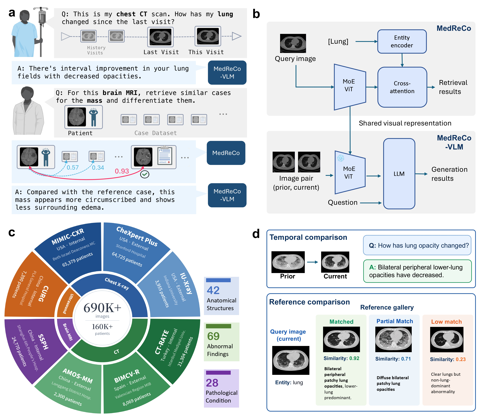

# MedReCo / MedReCo-VLM

<p align="center">
  <b>A Vision–language Framework for Comparative Reasoning in Radiology</b>
</p>

<p align="center">
  <a href="https://arxiv.org/abs/2606.06407"></a>
  <a href="https://huggingface.co/timeseed/MedReCoVLM"></a>
  <a href="https://github.com/time-seed/MedReCo"></a>
</p>

Official implementation of **MedReCo** and **MedReCo-VLM**.

---

## Overview

Radiologists rarely read an image in isolation. In routine practice, a diagnosis is reached by **comparison** — against a patient's prior studies to judge how a finding has changed, and against analogous reference cases to tell visually confusable entities apart. Most medical imaging AI, however, still follows a *single-image* paradigm and lacks explicit supervision for cross-image comparison.

MedReCo addresses this gap by formulating radiological comparison as an **entity-aware, cross-image reasoning problem**. The key idea is a **shared visual representation conditioned on clinical entities** — anatomical structures, abnormal findings and pathological conditions — so that two images can be compared *with respect to a specified entity* rather than only by global visual appearance. This single representation powers two complementary models:

* **MedReCo** — an entity-aware visual encoder for **controllable medical image retrieval**. Given a query image and a target entity, it ranks candidate cases by entity-specific similarity to retrieve clinically analogous references, supporting differential diagnosis (*reference comparison*). A lightweight token-level reranker refines the top candidates.
* **MedReCo-VLM** — a vision–language extension that connects the pretrained visual encoder to an LLM via instruction tuning, generating **natural-language comparative interpretations** of similarities, differences and interval changes between an image pair (*temporal / comparative comparison*).

Both models operate across four modality families:

| Modality | Description |
| :--- | :--- |
| `2D-CXR` | 2D Chest X-Ray |
| `3D-CT` | 3D Computed Tomography |
| `3D-Brain-MRI` | 3D Brain MRI |
| `2D-Ultrasound` | 2D Ultrasound |

The models are trained on **MedReCo-DB**, a large-scale comparative imaging resource derived from routine image–report pairs: **690,000+ images** from **160,000+ patients** across **8 institutions, 4 countries and 7 imaging modalities**. Reports are decomposed into structured entities — **42 anatomical structures, 69 abnormal findings and 28 pathological conditions** — providing scalable supervision for both entity-conditioned retrieval and comparative VQA.

<p align="center">
  
</p>

---

## Installation

```bash
conda create -n MedReCo python=3.11.12
conda activate MedReCo
pip install -r requirements.txt

cd transformer_maskgit
pip install -e .

cd ../CT_CLIP
pip install -e .

cd ..
```

---

## Data and Weights Preparation

**Weights.** Pretrained weights are available on Hugging Face: 🤗 [timeseed/MedReCoVLM](https://huggingface.co/timeseed/MedReCoVLM). After downloading, update the checkpoint paths in the inference scripts.

**Data.** All public datasets used in this study should be obtained from their original providers, in accordance with the corresponding licenses and data-use agreements. Derived annotations and benchmark splits will be released together with the organized dataset (see [TODO](#todo)).

---

## Quick Start

### Retrieval Inference

`inference/retrieval_inference.py` runs **pure image-to-image (i2i)** retrieval (no text involved):

1. **Coarse embedding** — one L2-normalized 512-d embedding per image
2. **Reranking** — token-level query–candidate comparison
3. **Score fusion** — `Score = alpha * cosine + (1 - alpha) * rerank_prob`

Configure the checkpoint and demo manifest at the top of the script:

```python
CHECKPOINT           = "checkpoints/MedReCoVLM/.pt"
TEXT_ENCODER_NAME    = "FremyCompany/BioLORD-2023"
CONDITION_INDEX_JSON = "configs/all_condition_index.json"
DEMO_MANIFEST        = "inference/examples/demo_cases.json"
ALPHA                = 0.7   # coarse / rerank fusion weight
```

In the manifest, the first case is the **query** and the rest are **candidates** (at least 2); `modality` and `condition` are shared across all cases:

```json
{
  "modality": "2D-CXR",
  "dataset_key": "MIMIC-CXR",
  "condition": "Pulmonary Parenchyma",
  "cases": [
    {"id": "query_case_id",       "image": "inference/examples/query.jpg"},
    {"id": "candidate_case_id_1", "image": "inference/examples/candidate_1.jpg"},
    {"id": "candidate_case_id_2", "image": "inference/examples/candidate_2.jpg"}
  ]
}
```

Run:

```bash
mkdir -p inference/outputs
python inference/retrieval_inference.py
```

This saves one normalized 512-d embedding per image to `inference/outputs/embedding_{i}.npy`, and prints the rerank scores and final ranking of the candidates:

```text
Output 2 | Rerank  (Score = 0.7*cosine + 0.3*rerank), query = query.jpg
  Candidate          |   CosSim |  RerankP |    Final
  --------------------------------------------------
  candidate_1.jpg    |   0.8239 |   0.7764 |   0.8096
  candidate_2.jpg    |   0.5788 |   0.5239 |   0.5624

  Final order (high -> low): candidate_1.jpg > candidate_2.jpg
```

### Comparative VQA Inference

`inference/vqa_inferece.py` takes two medical images and a comparison question, and generates a natural-language answer. Configure the paths:

```python
MODEL_PATH     = "checkpoints/MedReCoVLM/<vqa_model_dir>"
PROCESSOR_PATH = "configs"
```

Example input:

```python
messages = [
    {
        "role": "user",
        "content": [
            {"type": "image", "image": "inference/examples/vqa_image1.jpg"},
            {"type": "image", "image": "inference/examples/vqa_image2.jpg"},
            {"type": "text",  "text": "Comparing the two cases, how does the endotracheal tube tip's position relative to the carina differ between Case A and Case B?"}
        ]
    }
]
```

Run:

```bash
python inference/vqa_inferece.py
```

Example output:

```text
The image from Case A shows the endotracheal tube tip positioned below the
carina, while the image from Case B demonstrates the tip positioned above
the carina.
```

---

## Training and Evaluation

The repository contains the MedReCo-VLM model definitions, dataset utilities, trainer code, and retrieval training/evaluation utilities under `src/` and `scripts/`. The complete, reproducible training and evaluation scripts will be released after the dataset is organized and uploaded.

### Repository Structure

```text
MedReVLM/
├── configs/                      # Model and processor configs
├── inference/                    # Inference scripts and examples
│   ├── examples/                 # Demo images and JSON manifests
│   ├── retrieval_inference.py    # Coarse embedding + reranker inference
│   ├── retrieval_eval_dataset.py # Image loading and preprocessing
│   └── vqa_inferece.py           # Comparative VQA inference
├── src/                          # MedReCo-VLM model, dataset, trainer code
├── scripts/                      # Retrieval training/evaluation utilities
├── CT_CLIP/                      # CT-CLIP based retrieval components
├── transformer_maskgit/          # CTViT / visual encoder components
└── requirements.txt
```

---

## TODO

- [x] Release inference code
- [x] Release complete pretrained weights
- [x] Release train code
- [ ] Release full training and evaluation scripts (together with the organized dataset)

---

## Acknowledgements

This codebase is built upon the following excellent projects:

* [2U1/Qwen-VL-Series-Finetune](https://github.com/2U1/Qwen-VL-Series-Finetune)
* [ibrahimethemhamamci/CT-CLIP](https://github.com/ibrahimethemhamamci/CT-CLIP)

We sincerely thank the authors for their high-quality open-source work.

---

## Citation

If you find this work useful, please consider citing:

```bibtex
@article{zhang2026vision,
  title={A Vision-language Framework for Comparative Reasoning in Radiology},
  author={Zhang, Tengfei and Zhao, Ziheng and Dai, Lisong and Zhang, Xiaoman and Qiu, Pengcheng and Zhang, Ya and Wang, Yanfeng and Xie, Weidi},
  journal={arXiv preprint arXiv:2606.06407},
  year={2026}
}
```